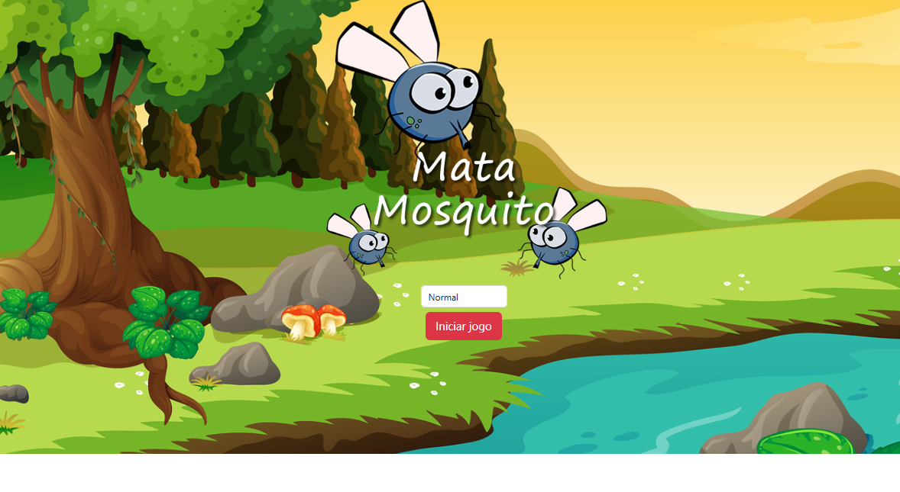

# 🦟💥 Jogo Mata Mosquito

O **Mata Mosquito** é um jogo simples e divertido onde você precisa clicar nos mosquitos que aparecem aleatoriamente na tela antes que eles sumam. Se perder 3 mosquitos, o jogo acaba! Ele foi feito com **HTML5**, **CSS3** e **JavaScript puro**, sendo ideal para treinar lógica, manipulação do DOM e eventos.

---

## 🛠️ Tecnologias

- 🌐 HTML5
- 🎨 CSS3
- ⚙️ JavaScript

---

## 🕹️ Como Jogar

1. Abra o arquivo `index.html` no navegador.  
2. Escolha a dificuldade: 🐢 Fácil | 🚶 Médio | 🚀 Difícil  
3. Clique nos mosquitos antes que desapareçam.  
4. Você tem 3 vidas! Cada mosquito perdido remove uma.  
5. Se o tempo acabar e você tiver vidas, você vence! 🏆

---

## 📁 Estrutura

MATA-MOSQUITO/
├── imagens/
│ ├── bg.jpg
│ ├── coracao_cheio.png
│ ├── coracao_vazio.png
│ ├── game_over.png
│ ├── game.png
│ ├── mata_mosca.png
│ ├── mosca.png
│ └── vitoria.png
├── app.html
├── fim_de_jogo.html
├── index.html
├── vitoria.html
├── jogo.js
├── style.css
└── README.md

---

## ✅ Aprendizados

- Manipulação de elementos com JavaScript  
- Uso de `setInterval` e `setTimeout`  
- Posicionamento aleatório de elementos na tela  
- Criação de lógica de vidas e pontuação  
